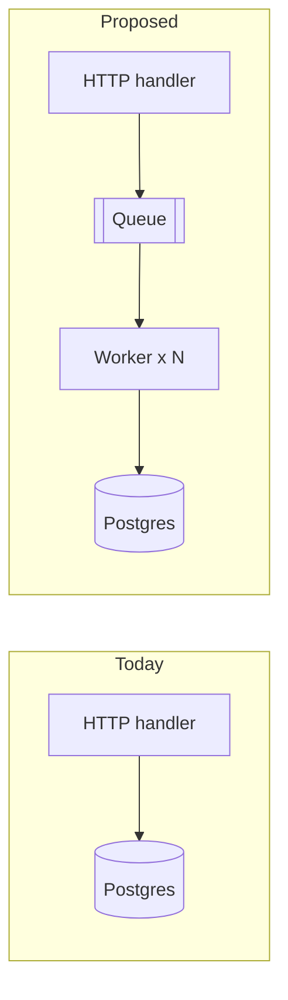

# Migrate the ingest pipeline to a queue

The current pipeline writes straight into Postgres from the HTTP handler. Under
load, handler latency tracks database latency and spikes cascade to clients.
This plan moves writes behind a durable queue so the HTTP path only validates
and enqueues.

<Callout kind="info" title="What I need from you">
Pick the queue technology below, and comment on anything that looks wrong.
Click any paragraph, chart, or diagram to leave feedback, then press
**Send to agent**.
</Callout>

<Question id="queue" options={["Redis Streams", "NATS JetStream", "Postgres table (SKIP LOCKED)"]}>
Which queue should v1 use?
</Question>

## Current vs. proposed

## Expected latency improvement

Weekly p50/p99 handler latency from the staging experiment (ms):

<Chart id="latency" title="Handler latency, staging" data="data/latency.json" xLabel="week" yLabel="ms" />

<Columns>
  <Column>
    <Stat label="p99 before" value="310 ms" />
  </Column>
  <Column>
    <Stat label="p99 after" value="210 ms" hint="-32%" />
  </Column>
</Columns>

## Rollout steps

1. Add the queue and a worker behind a feature flag (dark launch, dual write).
2. Compare row counts hourly for 3 days.
3. Flip the flag per tenant, largest last.
4. Remove the direct-write path.

## Risks

- **Ordering**: events for one tenant must stay ordered. Partition by tenant id.
- **Duplicates**: workers are at-least-once; upserts keep it idempotent.
- **Backpressure**: if the queue fills, the handler returns 503 with Retry-After.

See the [details page](#/s/demo/02-details) for schema changes and the worker loop.
