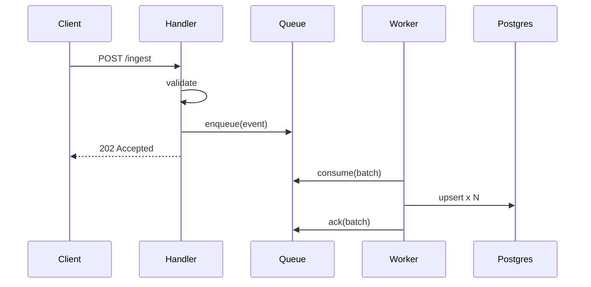

# Details

## Schema changes

| table | change | reversible |
|---|---|---|
| `events` | add `ingest_id uuid unique` | yes |
| `events` | add index on `(tenant_id, created_at)` | yes |
| `ingest_queue` | new (only for the Postgres-queue option) | yes |

## Worker loop

```ts
for await (const batch of queue.consume({ max: 100, wait: "1s" })) {
  await db.transaction(async (tx) => {
    for (const ev of batch) await tx.upsert("events", ev, { onConflict: "ingest_id" });
  });
  await queue.ack(batch);
}
```

## Sequence



<Question id="batch" text placeholder="e.g. 100, or 'measure first'">What batch size should the worker start with?</Question>
