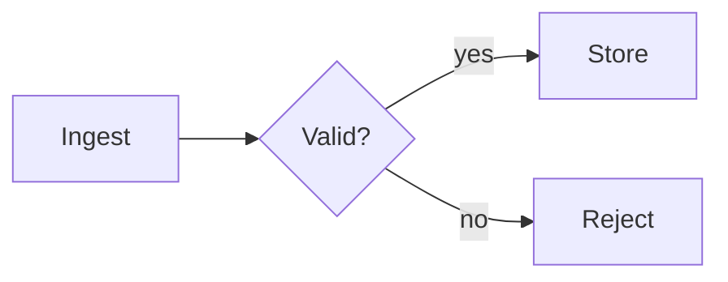

# Authoring pages

Pages are MDX: GitHub-flavoured Markdown plus the components below. One file
per page under `pages/`, sorted by filename (or `order:` in frontmatter).

```mdx
---
title: Overview
order: 1
---

# Migration plan

Plain Markdown works: **bold**, lists, tables, `code`, images, links.

<Callout kind="warning" title="Downtime">About 4 minutes during the cut-over.</Callout>
```

Every block-level element (paragraph, heading, list item, table, code block,
component) is individually commentable. Keep blocks reasonably small so
feedback lands precisely: split long paragraphs, one idea per list item.

## Components

### `<Chart>` — uPlot line/bar/scatter

```mdx
<Chart
  title="Latency (ms)"
  data={[[0, 1, 2, 3], [120, 110, 95, 90], [300, 280, 240, 210]]}
  series={["p50", "p99"]}
  xLabel="week" yLabel="ms"
/>
```

- `data`: uPlot columns, first column is x. Or an object `{ x: [...], series: { p50: [...], p99: [...] } }`.
  Or a path to JSON in the session (`data="data/latency.json"`), same shapes.
- `series`: labels, or objects `{ label, color?, width?, fill?, dash? }`. Colours are
  assigned automatically from a colour-blind-safe palette; do not set colours
  unless they carry meaning. Max 8 series; split otherwise.
- `type`: `"line"` (default), `"bars"`, `"points"`.
- `x`: `"number"` (default) or `"time"` (x values are unix **seconds**).
- `height` (px, default 280), `zero` (force y axis from zero; default for bars).
- Hover shows values; "Show as table" is built in.

### Mermaid diagrams

Fenced code with `mermaid` renders as a diagram (or `<Mermaid chart={`...`} />`):

````mdx

````

Supports flowchart, sequence, class, state, ER, gantt, pie, mindmap, timeline,
git graph, etc. Keep node labels short; complex diagrams get their own page.

### `<Question>` — ask the human

```mdx
<Question id="db" options={["Postgres", "SQLite"]}>Which store for v1?</Question>
<Question id="notes" text placeholder="Anything else?">Other constraints?</Question>
```

Props: `id` (required, unique per session), `options` (string[]), `multiple`,
`text` (free-text field; default on when there are no options), `placeholder`.
The answer comes back as an `ANSWER` feedback item.

### `<Folder>` — open a local path

```mdx
<Folder path="C:/repo/src/server">server sources</Folder>
See also [the migrations](file:///C:/repo/db/migrations).
```

Opens folders in the OS file manager and reveals files (never runs them).
Paths must be absolute and inside the session's allowed roots (`pp new --root`).

### Layout & content

```mdx
<Section id="risks" title="Risks">…</Section>

<Columns min="16rem">
  <Column>left</Column>
  <Column>right</Column>
</Columns>

<Stat label="Rows migrated" value="1.2M" hint="of 1.4M" />

<Callout kind="info|note|tip|warning|danger|success" title="…">…</Callout>

<Figure src="assets/before.png" caption="Before" width="60%" />
```

`id` on `Section`, `Chart`, `Mermaid`, `Question` makes feedback reference that
id (`target #risks`) in addition to the line range.

### Media

Standard Markdown/HTML, relative to the session directory:

```mdx

<Video src="assets/demo.mp4" />
<Audio src="assets/clip.m4a" />
<video controls src="assets/demo.webm" />
```

Anything under the session directory is served read-only. Copy files in; do
not link to paths outside it.

### Code

Fenced code blocks render monospaced with the language shown. Keep snippets
short: the human comments per block.

## Tips

- Lead with a one-paragraph summary and a `<Question>` for the decision you
  most need; details go on later pages.
- Use headings generously: each is a comment anchor and shows in excerpts.
- After feedback, edit in place rather than appending "v2" sections; the human
  sees a live reload and their existing comments stay attached to unchanged blocks.
- Blocks whose text you rewrite get a new id; the old comment shows "block changed".
  Resolve it after addressing it.
